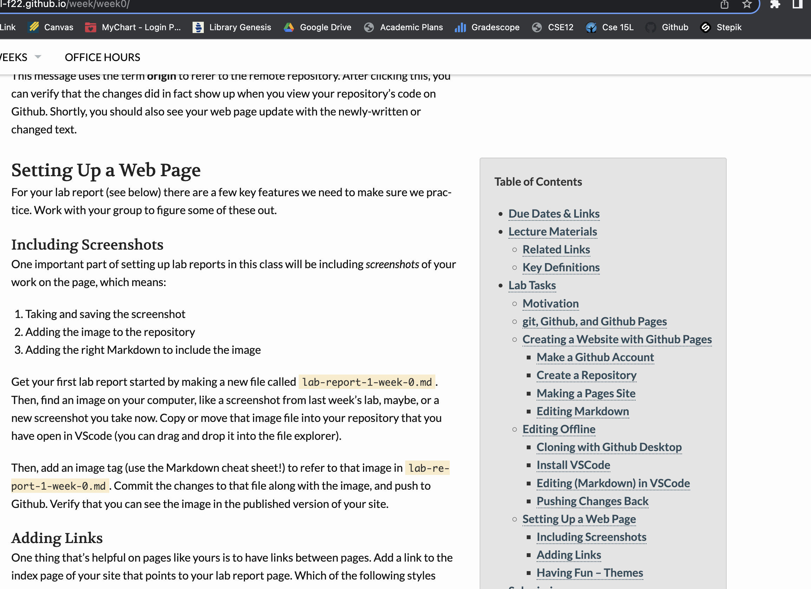
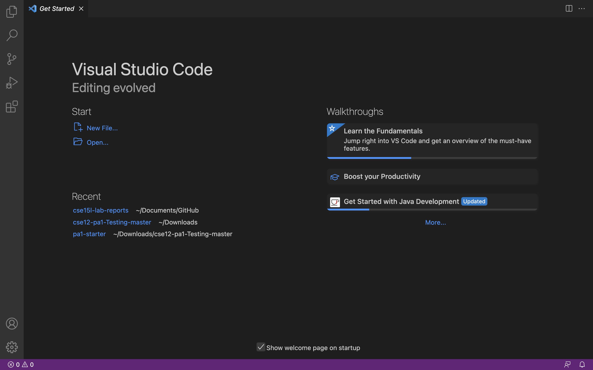
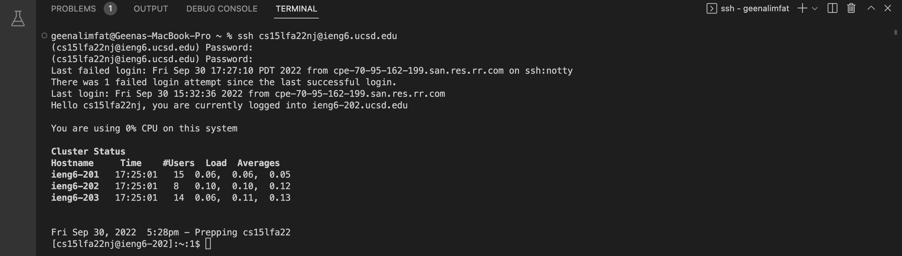
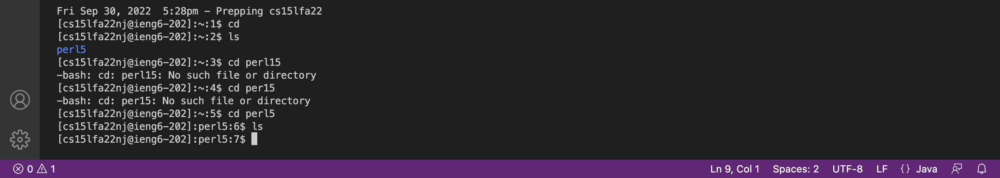
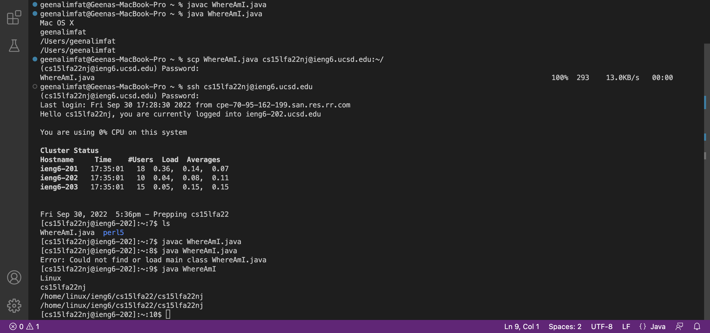
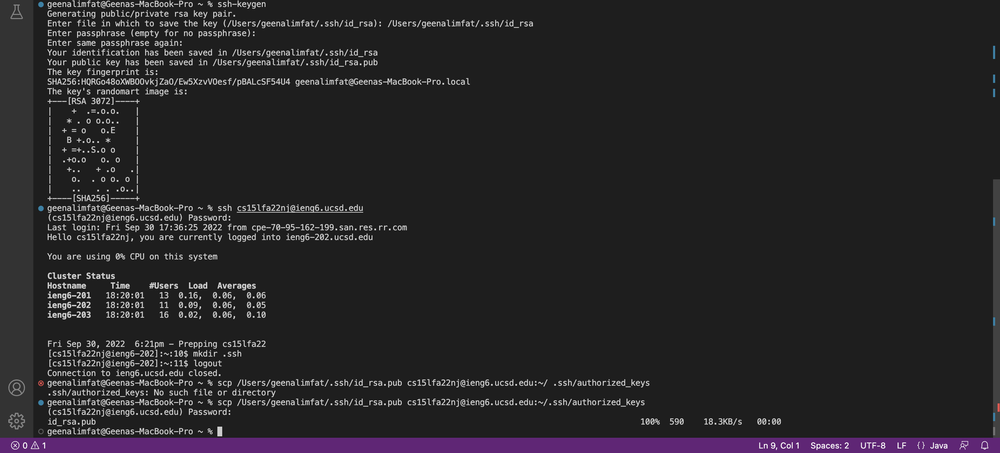
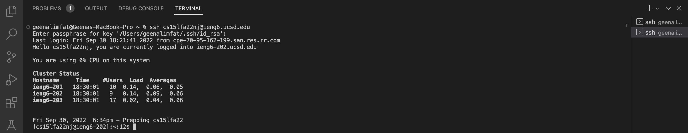
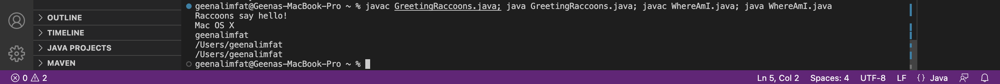

## **Week 0 Assignment**

# **Lab Report 1**

## Step 1: **Installing VScode**
1. Visit [Visual Code Website](https://code.visualstudio.com/) and follow the steps to downloading the program on your computer.
2. Install the OSX version for Macs and Windows for PCS.
3. Once downloaded, drag the program into your application folder and open it. 
4. The start up page should look like this:

## Step 2. **Remotely Connecting** (Mac)
1. Open terminal on VSCode using Command + `.
2. Enter **cs15lfa22xx@ieng6.ucsd.edu** where "xx" are the specific letters to your account.
3. If it is your first time remotely connecting a message will appear on screen. Type in 'yes' to proceed and enter your password.
4. The interaction should look like this: 

## Step 3. **Trying Some Commands**
1. The command `cd` followed by a file name allows you to change between directories in your file. 
2. The command `ls` lists out the files in the directory you're in.

3. In the image above, the command `ls` showed the files in the directory I was in.
4. The command `cd perl5` switched us to the the perl5 file.
    * Make sure to spell the file name correctly. As shown above, "perl15" and "per15" were entered instead.

## Step 4. **Moving Files With `scp`**
1. Moving files with `scp` allows you to securely move files between your personal computer and remote computer.
2. The file `WhereAmI.java` is in our personal computer and was compiled and run to make sure it ran correctly. 
3. On our personal computer, type in the command `scp WhereAmI.java cs15lfa22xx@ieng6.ucsd.edu:~/` replacing "xx" with your own username.
4. Enter your password to your remote account and the `WhereAmI.java` file should be copied into your remote account.
5. Log into your remote account and run `ls` to check if `WhereAmI.java` was successfully copied and compile and run to file.

## Step 5. **Setting an SSH Key**
1. Setting up an SSH key allows you to log into your remote account with a shared personal account using a shared passphrase without needing to type in the password each time.
2. On your personal computer, enter the command `ssh-keygen` to create the shared key. 
3. Enter the passphrase you would like to set. The computer will prompt you to enter the same passphrase again. 
4. The computer will ask which file to save the key. Enter
`(/Users/xxxx/.ssh/id_rsa):` where "xxxx" is your username to your personal computer.
5. This copied your key into your private account. Next, sign into your remote account using your original password.
6. Enter the command `mkdir .ssh` and logout.
7. Now on your private computer, enter `scp /Users/xxxx/.ssh/id_rsa.pub cs15lfaxx@ieng6.ucsd.edu:~/.ssh/authorized_keys` using your own usernames
8. Re-enter your original remote account password when prompted and now the key should be set

9. The image below shows how ssh key should work when everything runs correctly and you try to sign into your remote account.

## Step 6. **Optimizing Remote Running**
1. When entering our remote account through ssh, we can add a command in quotations at the end of the login to run the command immediately. 
2. For example, when you enter `ssh cs15lfaxx@ieng6.ucsd.edu "ls"` and enter your passphrase, immediately upon login the files in the directory will display

3. We can run multiple commands on the same command line by separating them with a semicolon `;`. 
    * The file GreetingsRaccoons.java was created to demonstrate multiple files being run

4. Pressing the up arrow on the keyboard will recall the last command that was run.
