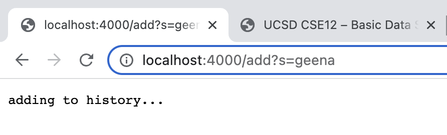
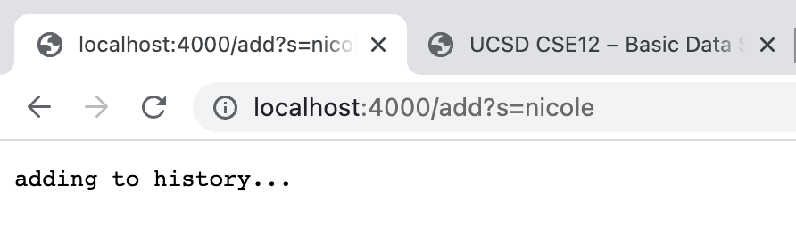
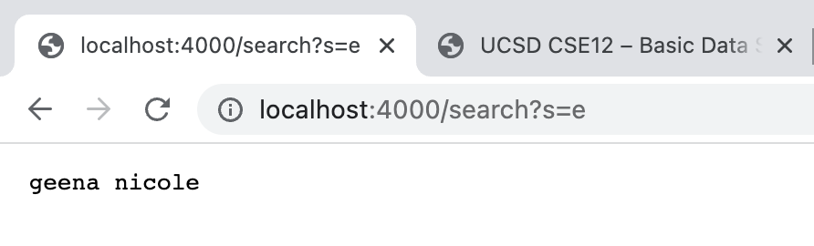
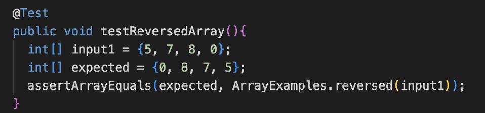
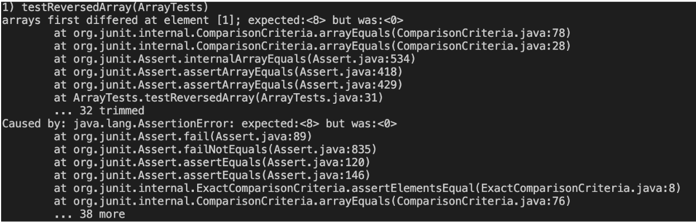
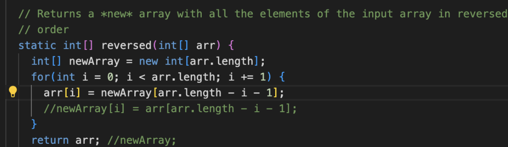
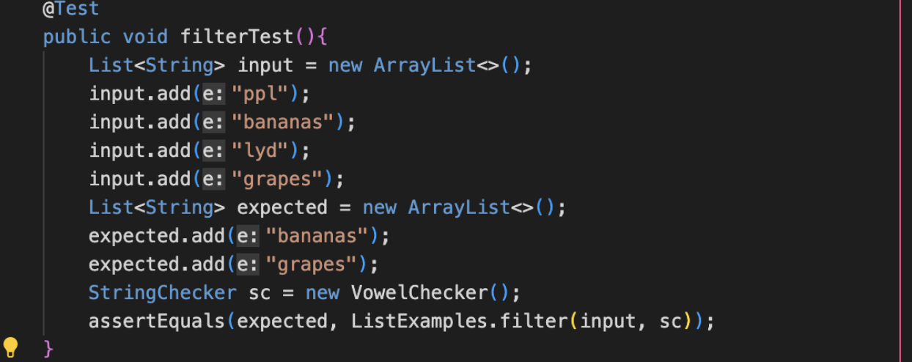
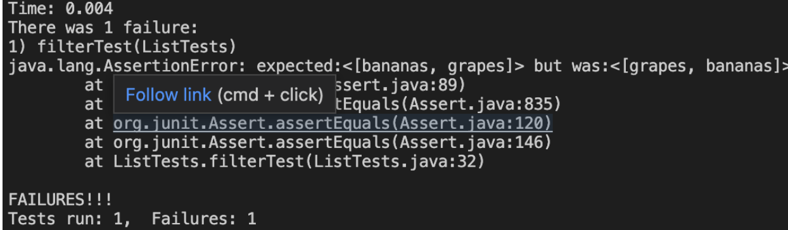
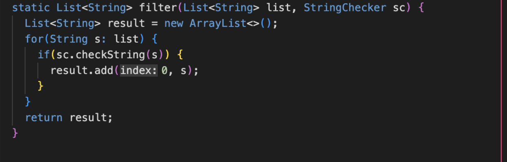

# **Lab Report 2**

## **Part 1:** Simple Search Engine
***
`SearchEngine.java`
```
import java.io.IOException;
import java.net.URI;
import java.util.ArrayList;

class Handler implements URLHandler {
    // The one bit of state on the server: a number that will be manipulated by
    // various requests.    
    ArrayList<String> list = new ArrayList<String>();

    public String handleRequest(URI url) {

        String searched = "";

        if (url.getPath().equals("/")) {
            return String.format("Search engine home");
        } 
        else if (url.getPath().equals("/add")) {
            String[] parameters = url.getQuery().split("=");
            if(parameters[0].equals("s")){
                list.add(parameters[1]);
                return "adding to history..." ;
            }
        }
        else if (url.getPath().equals("/search")) {
            String[] parameter = url.getQuery().split("=");
            if(parameter[0].equals("s")) {
                for(String s : list){
                    if(s.contains(parameter[1])){
                        searched = searched + " " + s; 
                    }
                }
                return searched;
            }
        } 
            return "404 Not Found!";
        }
    
}

class SearchEngine {
    public static void main(String[] args) throws IOException {
        if(args.length == 0){
            System.out.println("Missing port number! Try any number between 1024 to 49151");
            return;
        }

        int port = Integer.parseInt(args[0]);

        Server.start(port, new Handler());
    }
}    
```
The Search Engine code above creates a local URL which allows us to add phrases into an ArrayList with `\add?s=xxx` where `xxx` is the phrase we are adding, and allows us to search within the Arraylist with the command `\search?s=zzz` where `zzz` is the what we are searching for within the ArrayList. Any phrase that we added that contains `zzz` will appear on screen. 

***

### **Home Page**


The image above shows the Search Engine homepage which is shown when the URL is first created and clicked. It is the basic URL without any additional queries or paths added. In the `SearchEngine.java` file, `class SearchEngine` is called to create the local host URL. To create the local host URL, `Search.java` and `SearchEngine.java` is compiled and `SearchEngine ####` is called in terminal, where `####` represents the port number for our local host. In the image above, **4000** is the port number called.

***
### **Adding a word**


Adding the word *geena* to history.


Adding the word *nicole* to history.

The images above shows the URL and query where the word *geena* and *nicole* are being added to the ArrayList called `list`. The `/add` in the URL indicates a path which runs the block of code to add the word into the ArrayList:
```       
 else if (url.getPath().equals("/add")) {
            String[] parameters = url.getQuery().split("=");
            if(parameters[0].equals("s")){
                list.add(parameters[1]);
                return "adding to history...";
            }
        }
```
The Arraylist `parameters` splits the URL with the `.getQuery()` method at the query at the `=` and adds the "s" as `parameters[0]` and the word being added as `parameters[1]`. The `if-statement` checks to ensure that "s" is at `parameter[0]`, then adds `parameters[1]` to ArrayList `list`. Then the phrase "adding to history..." is printed on the page, indicating tht the word is sucessfully being added to the list. 

***
### **Searching**


The image above shows the URL and query where the letter *e* is being searched for in the words in ArrayList `list`. An empty String `searched` was created and outside the `if-else statement` in order to store the values of the words with the searched value. The `\search` in the URL indicates a path that runs the block of code to search for the letter *e* in the words of the ArrayList:
```
 else if (url.getPath().equals("/search")) {
            String[] parameter = url.getQuery().split("=");
            if(parameter[0].equals("s")) {
                for(String s : list){
                    if(s.contains(parameter[1])){
                        searched = searched + " " + s; 
                    }
                }
                return searched;
            }
```
Similar to the `/add` path, the Arraylist `parameter` splits the URL with the `.getQuery()` method at the query at the `=` and adds the "s" as `parameters[0]` and the word being added as `parameters[1]`. The `if-statement` checks to ensure that "s" is at `parameter[0]`, then enters a `for-loop` to iterate through the ArrayList `list`. The `if-statement` in the `for-loop` checks each word in the `list` whether it contains the letter/phrase that the user is searching for. If a word does contain what the user is searching for, it is added to the `searched` variable where it is stored and later returned after the loops iterates through the entire array. The words that contain the letter/phrase are printed to the screen. 
***

## **Part 2:** Bugs

### Bug 1: `ArrayExamples.java`
***
**Failure-Inducing Input**:

***
**Symptom:**

***
**Bug:**

***
The method `reversed` is supposed to return a new array with all the elements of the input array in reversed order, however, the bug does not reverse the array and instead returns the inputed array `arr` with all the values as zero. This is because of the line of code: 

`arr[i] = newArray[arr.length - i - 1];`

Instead of assigning the i-value of `newArray` to the last element minus i of the original array `arr`, it assigns the i-value of `arr` to the last element minus i of `newArray`. Since newArray is created and instantiated, the values inside of the array are all zero, therefore setting all the values of `arr` to zero. The symptom is the assert error caused by the the method not working correctly on the inputed array and thus not matching the expected array. The symptom says `<8>` was expected but instead `<0>` was the value. Again, this is because the bug turned all the values of `arr` to zero instead of reversing it. The code also returns the original array `arr` instead of `newArray`. The comments in the image that shows the bug is what the code should be instead.

***
### Bug 2: `ListExamples.java`
***
**Failure-Inducing Input**:

***
**Symptom:**

***
**Bug:**

***
The method `filterTest` is supposed to return a new list of all the elements of the input list where the StringChecker `VowelChecker` checks if the element contians a vowel. If the element of the input list contains a vowel, it will be added into the new list in the same order as the input list. However, the bug causes the elements of the new list to be added in reverse order. This is because of the line of code:     
` result.add(0,s);`

This line of code adds the checked element s at the beginning of the list each time, therefore reversing the order. Instead, the line of code should be:

`result.add(s)`

This will add the the checked elements into the new list in the original order. The symptom of this bug is the assert error caused by the method reversing the order of the elements. The symptom says `<bananas, grapes>` was expected but the values were `<grapes, bananas>` instead. This shows that the bug in the code where the order was reversed. 