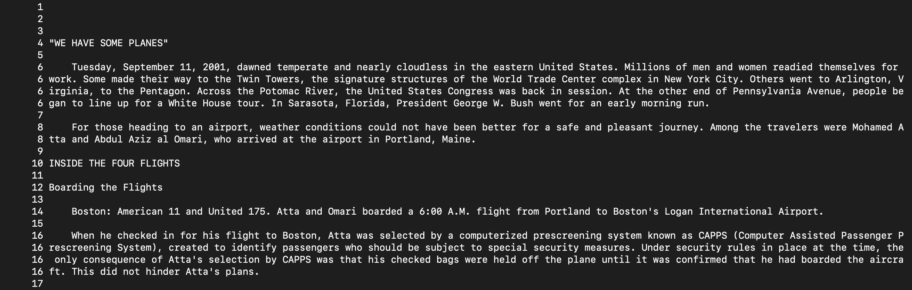
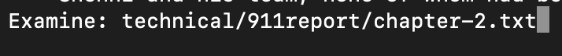
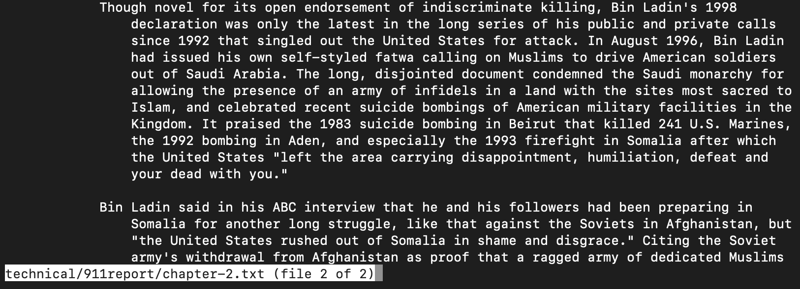
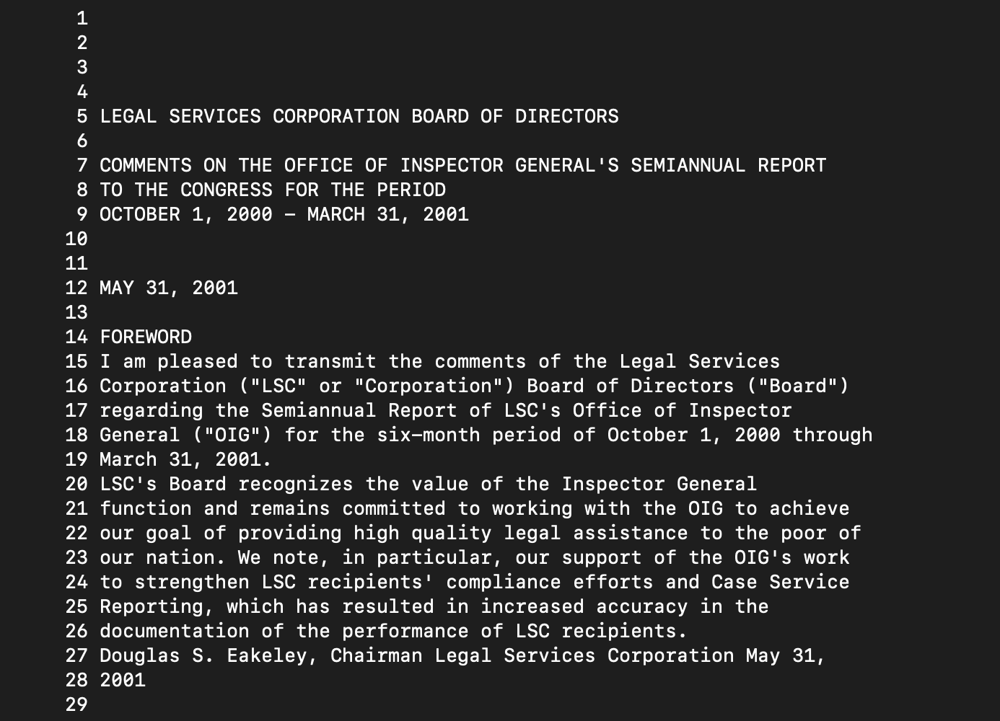
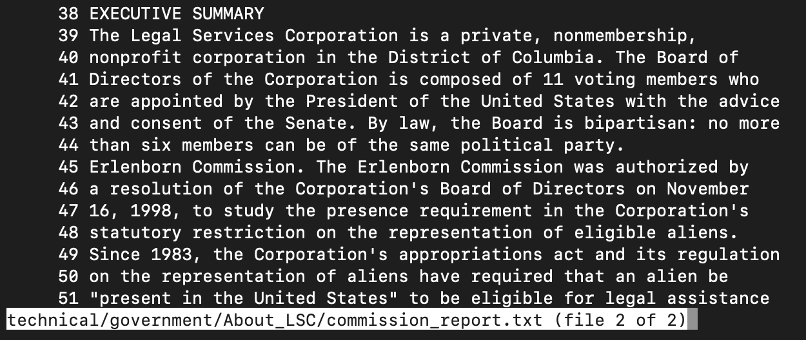
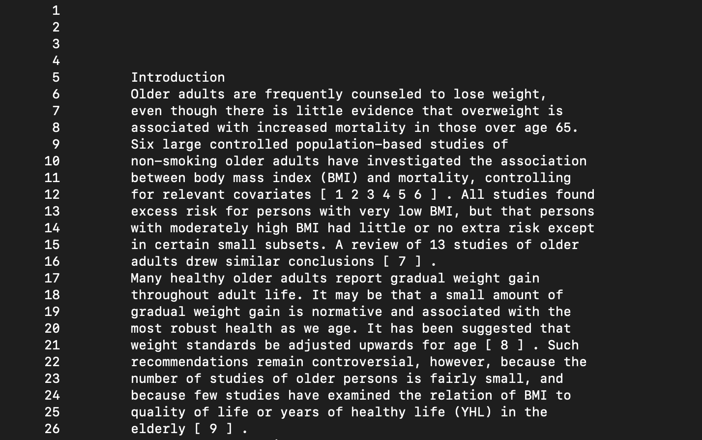
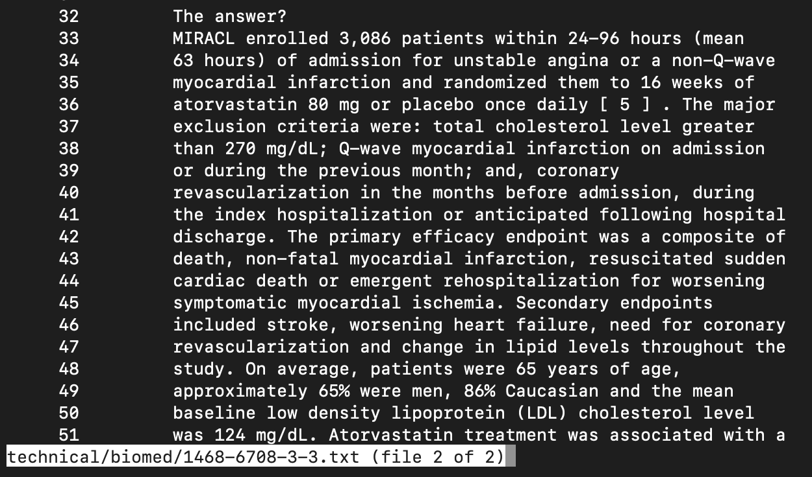

# **Lab Report 3**
## `Less`

The command `less` will 'take-over' the terminal by opening the contents of a file and allow the user to quickly scan through the document. The user scrolls through the document with the up and down keys or can hit the spacebar to go down a screen. To exit, the user can press `q`. Some of the commands that can be paired with `less`  are:
   * `-N`
     * In command line when we enter `less -N <filename>`, the file we want to open will display the file with each line numbered:
   * `/pattern`
     * When we are in the screen that displays the content of the file, at the bottom of the screen where there's a colon, we can enter more commands. If we enter `/pattern` where `pattern` is a character or word we want to search for in the file, the `pattern` will be highlighted throughout the document wherever it occurs.
   * `:e <filename>`
     * If the user wants to move on to the next file, they can switch while in their current file by entering the command `e <filename>` where `filename` is the path to the file they want to open.

***
### 911report: 
1. `less -N technical/911report/chapter-1.txt`

The command `less -N technical/911report/chapter-1.txt` is being called to preview the first chapter in the 911 report file: 

***

The output of this command shows the contents of the files numbered. This is helpful if the user wants to know the specific line a sentence is on.

***
2. `/plane`

If the user wants to search for the `pattern` "plane" in`chapter-1.txt`, they would input the command `/plane` to search for the word throughout the file:

***

The output of this command will highlight the `pattern` "plane" throughout the document. This is helpful when the user wants to find where the article starts mentioning planes. 

***

3. `e technical/biomed/chapter-2.txt`

To move onto chapter 2 of the 911 reports, the user would enter `e technical/biomed/chapter-2.txt`. This makes it easier for the user to switch between file contents. 

 ##### *Note that the command `e` will turn into `Examine` in terminal. 
 ****
 We see here that the contents of the file has changed and at the bottom of the screen we have moved onto file 2. The command at the bottom shows the user that they have indeed switched between the files.
 
***
***Government***

1. `less -N */*/*/Comments_on_semiannual.txt`

The command `less -N */*/*/Comments_on_semiannual.txt` will open the file `Comments_on_semiannual.txt` file that is in the directory `technical`, the sub directory `Government`, and the next sub directory `About_LSC`. It will display the contents of the file with the lines numbered next to it:

***
The image below shows the output of this command with the lines of this file numbered. In this case, it may be helpful for the user if they want to note down the exact line where the speaker says something for a quote. 

***

2. `/2000`

Calling this command will highlight the number `2000` anytime it occrs in the file:

***
The image below shows the number `2000` highlighted in the lines seven through nineteen. In this case, it may be helpful to search the year `2000` so that the user can distinguish what happened in the year 2000 and the year 2001

***

3. `e */*/*/commission_report.txt`

The command `e */*/*/commission_report.txt` will move the user to the `commission_report.txt` file in the same sub directories as `Comments_on_semiannual.txt`.

***
The bottom line of the image shows that the user has sucessfully moved between files into `commission_report.txt`. 

***

## Biomed
1. `less -N technical/biomed/1468-6708-3-1.txt`

Calling the command `less -N technical/biomed/1468-6708-3-1.txt` will open the `1468-6708-3-1.txt` file in biomed and display the line numbers.

***
The image below shows the contents of the file with the lines numbered. This can be helpful if the user needs to cite certain part of the article.

***

2. `/weight`
If we want to find out where the word "weight" is mentioned in the file, we could enter the command `/weight` while in the file and the word will be highlighted throughout.

***
The pattern `weight` is now highlighted throughout the article. This can be useful if the user wants to find the parts of the article where `weight` is mentioned. 

***

3. `e technical/biomed/1468-6708-3-3.txt`

The command `e technical/biomed/1468-6708-3-3.txt` will move the user to the next file in the sub directory.

***
The image below shows that the user has sucessfully moved to the `1468-6708-3-3.txt` file. 
