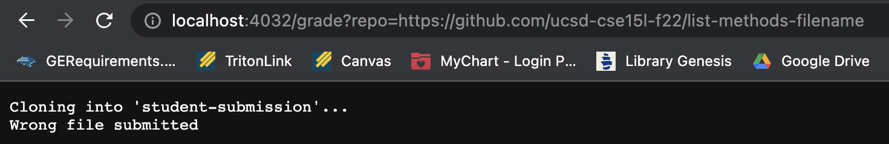
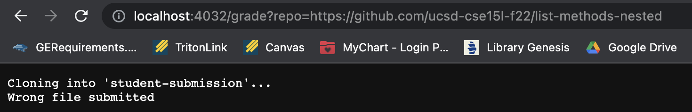
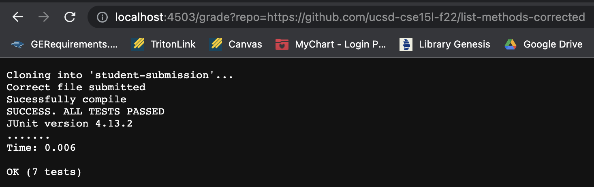
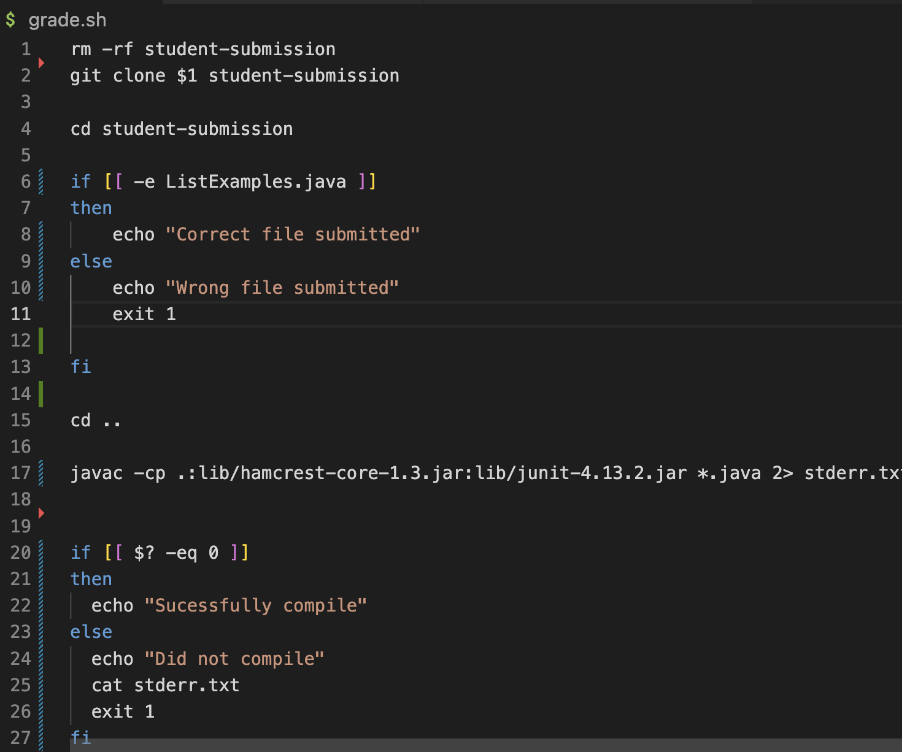
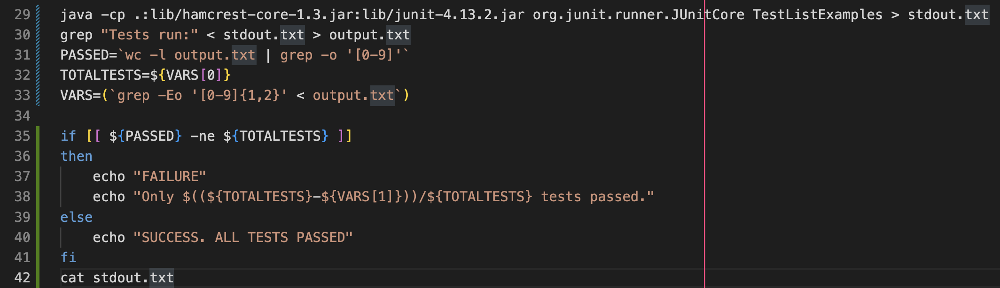

# **Lab Report 5**
**Wrong File**:

**Nested**:

**Corrected Method**:

**Tracing: Nested**

Line 1: `rm -rf student-submission`   
 Removes any file in our repository that has the name `student-submission` so that we can start with a new student submission each time `grade.sh` is used.   

Line 2: `git clone $1 student-submission`   
Clones the first parameter entered in terminal into `student-submission` which will be the link to the student's repository that is being checked: https://github.com/ucsd-cse15l-f22/list-methods-nested

Line 4: `cd student-submission`   
Changes directory to `student-submission`

Line 6: `if [[ -e ListExamples.java ]]`   
Checks if the file `ListExamples.java` exists in the repository. Since in this repository where it is nested in another directory called `pa1`, it is not searching in the correct directory which causes Lines 10-11 to run and skips line 8.

Line 10: `echo "Wrong file submitted"`   
Prints out the phrase `Wrong file submitted` to the screen. 

Line 11: `exit 1`   
Uses the exit code of 1 to stop the program. Since the code stops running at line 11, all the lines after it fail to run. 

